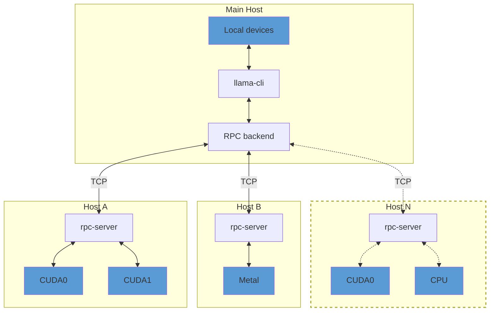

## Overview

> [!IMPORTANT]
> This example and the RPC backend are currently in a proof-of-concept development stage. As such, the functionality is fragile and
> insecure. **Never run the RPC server on an open network or in a sensitive environment!**

The `rpc-server` allows exposing `ggml` devices on a remote host.
The RPC backend communicates with one or several instances of `rpc-server` and offloads computations to them.
This can be used for distributed LLM inference with `llama.cpp` in the following way:



By default, `rpc-server` exposes all available accelerator devices on the host.
If there are no accelerators, it exposes a single `CPU` device.

## Usage

### Remote hosts

On each remote host, build the backends for each accelerator by adding `-DGGML_RPC=ON` to the build options.
For example, to build the `rpc-server` with support for CUDA accelerators:

```bash
mkdir build-rpc-cuda
cd build-rpc-cuda
cmake .. -DGGML_CUDA=ON -DGGML_RPC=ON
cmake --build . --config Release
```

When started, the `rpc-server` will detect and expose all available `CUDA` devices:

```bash
$ bin/rpc-server
ggml_cuda_init: GGML_CUDA_FORCE_MMQ:    no
ggml_cuda_init: GGML_CUDA_FORCE_CUBLAS: no
ggml_cuda_init: found 1 CUDA devices:
  Device 0: NVIDIA GeForce RTX 5090, compute capability 12.0, VMM: yes
Starting RPC server v3.0.0
  endpoint       : 127.0.0.1:50052
  local cache    : n/a
Devices:
  CUDA0: NVIDIA GeForce RTX 5090 (32109 MiB, 31588 MiB free)
```

You can control the set of exposed CUDA devices with the `CUDA_VISIBLE_DEVICES` environment variable or the `--device` command line option. The following two commands have the same effect:
```bash
$ CUDA_VISIBLE_DEVICES=0 bin/rpc-server -p 50052
$ bin/rpc-server --device CUDA0 -p 50052
```

### Main host

On the main host build `llama.cpp` with the backends for the local devices and add `-DGGML_RPC=ON` to the build options.
Finally, when running `llama-cli` or `llama-server`, use the `--rpc` option to specify the host and port of each `rpc-server`:

```bash
$ llama-cli -hf ggml-org/gemma-3-1b-it-GGUF -ngl 99 --rpc 192.168.88.10:50052,192.168.88.11:50052
```

By default, llama.cpp distributes model weights and the KV cache across all available devices -- both local and remote -- in proportion to each device's available memory.
You can override this behavior with the `--tensor-split` option and set custom proportions when splitting tensor data across devices.

### Local cache

The RPC server can use a local cache to store large tensors and avoid transferring them over the network.
This can speed up model loading significantly, especially when using large models.
To enable the cache, use the `-c` option:

```bash
$ bin/rpc-server -c
```

By default, the cache is stored in the `$HOME/.cache/llama.cpp/rpc` directory and can be controlled via the `LLAMA_CACHE` environment variable.

### RDMA (experimental)

The RPC transport is pluggable and supports an experimental RDMA transport for high-throughput low-latency transfers. RDMA support is disabled by default and must be enabled at build time:

```bash
cmake .. -DGGML_RPC=ON -DGGML_RPC_RDMA=ON
cmake --build . --config Release
```

When RDMA is enabled, use the `rdma://` scheme to select the RDMA transport when specifying endpoints (e.g. `rdma://192.168.1.10:50052`). RDMA is only supported on Linux and requires RDMA-capable hardware and the `libibverbs` / `librdmacm` libraries.

> ⚠️ **Security**: RDMA bypasses parts of the OS networking stack and can expose memory directly on the fabric. Never enable RDMA on untrusted networks and follow your infra security policies.

### Troubleshooting

Use the `GGML_RPC_DEBUG` environment variable to enable debug messages from `rpc-server`:
```bash
$ GGML_RPC_DEBUG=1 bin/rpc-server
```

Reliability & shutdown

- Retry configuration (client-side):
  - `GGML_RPC_RETRY_COUNT` (default: 3) — number of reconnect attempts on transient failures
  - `GGML_RPC_RETRY_BACKOFF_MS` (default: 200) — base backoff in milliseconds (exponential backoff is applied)

- Graceful shutdown: `rpc-server` now supports SIGINT/SIGTERM (Ctrl+C) and will attempt a clean shutdown (stop accepting new connections and finish serving existing ones) instead of unconditionally aborting.

### Performance tuning (network / transport)

The RPC server exposes several environment variables that allow tuning socket-level and worker parameters for high-throughput and low-latency Ethernet deployments. These are optional and safe to change per-host.

- `GGML_RPC_SNDBUF` / `GGML_RPC_RCVBUF` — set send/receive buffer sizes (bytes). Default: OS default. Example: `GGML_RPC_SNDBUF=262144 GGML_RPC_RCVBUF=262144`
- `GGML_RPC_REUSEPORT` — enable `SO_REUSEPORT` (Linux) to allow multiple processes or threads to accept on the same port for better scaling. Default: 0 (disabled).
- `GGML_RPC_NO_DELAY` — set to `0` to disable `TCP_NODELAY` (Nagle) if you prefer coalesced packets for throughput. Default: `1` (no delay).
- `GGML_RPC_QUICKACK` — enable `TCP_QUICKACK` (Linux) to request immediate ACKs; use with care. Default: 0 (disabled).
- `GGML_RPC_N_WORKERS` — number of worker threads that handle accepted client connections (default: CPU cores - 1). Use this to proportion how many connections are handled concurrently without spawning/detaching new threads.
- `GGML_RPC_COMPRESSION` — enable on-the-wire compression for RPC messages. Supported values: `none` (default), `zstd` (if zstd is available at build time). Example: `GGML_RPC_COMPRESSION=zstd`.
- `GGML_RPC_COMPRESSION_MIN_SIZE` — minimum size in bytes before attempting compression. Default: `4096` (4 KiB). This prevents compressing small messages where overhead outweighs gain.

Start with conservative values and profile throughput/latency using the `tools/server/bench` scripts or custom RPC tests (see `tools/server/bench/`).

Example: use the included micro-benchmark to measure RPC round-trip latency:

```bash
python tools/rpc/bench/bench_rpc.py 127.0.0.1 50052 1000
```

